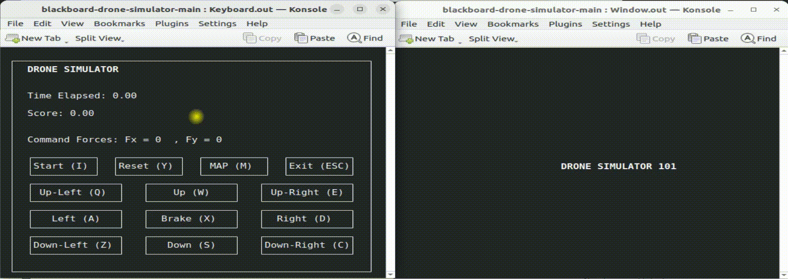

# 2D Drone Simulation – Multi-Process Blackboard Architecture

## 1. Overview

This project implements a 2D drone simulation using a multi-process architecture and a shared **blackboard** data structure.  
Processes communicate through **POSIX shared memory** and synchronize using a **POSIX named semaphore**.



The system consists of:
- A drone physics engine (**Dynamics**)
- A visualization interface (**Window**, ncurses)
- A control interface (**Keyboard**, ncurses)
- Random obstacle and target generators (**Obstacle / Target**) *(Assignment 2 mode)*
- A central blackboard (**shared state**)
- A master process that spawns and supervises all children (**Master**)

**Assignment 2 additions:**
- A **Watchdog** process that monitors component liveness using heartbeat messages.
- A centralized **logger** that provides systematic debug output.
- Proper **IPC cleanup** (shared memory, semaphore, named pipes) to avoid leftover resources.

---

## 2. Repository Structure

```
.
├── bins
│   ├── Dynamics.out
│   ├── Keyboard.out
│   ├── Obstacle.out
│   ├── Target.out
│   ├── Watchdog.out
│   └── Window.out
├── config.json
├── executer.sh
├── logs
│   └── simulation.log
├── master
└── src
    ├── blackboard.h
    ├── dynamics.c
    ├── keyboard.c
    ├── logger.c
    ├── logger.h
    ├── master.c
    ├── obstacle.c
    ├── target.c
    ├── watchdog.c
    └── window.c
```

---

## 3. System Architecture

The architecture follows the classical **Blackboard Model**:

- All processes share the same memory segment  
- Processes cooperate indirectly through the blackboard  
- Synchronization is enforced using a named semaphore  
- The master process handles spawning, supervision, and shutdown  
- A watchdog supervises process liveness using named pipes (FIFO) *(Assignment 2 mode)*

### Architecture Diagram

```
                           +----------------------+
                           |    Master Process    |
                           |  (spawns/terminates) |
                           +----------+-----------+
                                      |
      +-------------------------------+---------------------------------------------+
      |               |               |               |              |              |
      v               v               v               v              v              v
+-----------+   +-----------+   +-----------+   +-----------+   +-----------+  +-----------+
| Blackboard |   |  Window   |   | Keyboard  |   | Dynamics  |   | Obstacle  |  |  Target   |
| (server)   |   | (ncurses) |   | (ncurses) |   |  Engine   |   | Generator |  | Generator |
+-----+-----+   +-----+-----+   +-----+-----+   +-----+-----+   +-----+-----+  +-----+-----+
      |               \             |               /                 |              |
      |                \            |              /                  |              |
      v                 v           v             v                   v              v
+--------------------------------------------------------------------------------------------+
|                         POSIX SHARED MEMORY (IPC CORE)                                     |
|            Data: newBlackboard   |   Sync: SEM_NAME   |   Name: SHM_NAME                   |
+--------------------------------------------------------------------------------------------+

                           (Assignment 2 - Fault Detection)
+-----------+        Heartbeat via Named Pipes (FIFO in /tmp)         +----------------------+
| Watchdog  | <-----------------------------------------------------> |  All child processes |
|           |   PIPE_WINDOW / PIPE_KEYBOARD / PIPE_DYNAMICS / ...     |  (send heartbeat)     |
+-----------+                                                          +----------------------+

                           (Assignment 2 - Systematic Debug Output)
+--------------------------------------------------------------------------------------------+
| LOGGER MODULE (logger.c / logger.h)                                                        |
| All components write systematic debug output to: logs/simulation.log                        |
+--------------------------------------------------------------------------------------------+
```

---

## 4. Components

### Blackboard (shared memory struct in `blackboard.h`, initialized by `master.c`)
- Defines the shared state structure (`newBlackboard`) in `blackboard.h`
- `master.c` creates and initializes POSIX shared memory + semaphore
- Other processes attach to the blackboard to read/write their part of the state
- Reads `config.json` at runtime to refresh parameters (including obstacle/target counts)

### Dynamics (`dynamics.c`)

This module computes the drone motion using a discrete-time second-order dynamic model with viscous damping.

**Mathematical update equation:**

$$
x_{i+1} = \frac{F_x \cdot DT^2 - M (x_{i-1} - 2x_i) + K \cdot DT \cdot x_i}{M + K \cdot DT}
$$

$$
y_{i+1} = \frac{F_y \cdot DT^2 - M (y_{i-1} - 2y_i) + K \cdot DT \cdot y_i}{M + K \cdot DT}
$$

Force components:
- Command forces from keyboard  
- Repulsive forces from obstacles (Latombe/Khatib model)  
- Attractive forces from targets  
- Collision detection and distance tracking  
- Boundary constraints (geo-fencing)

### Window (`window.c`)
Ncurses-based visualization:
- Drone position  
- Obstacles and targets  
- Score and elapsed time  
- 2D grid map  
- Lateral inspection area (time/score/forces/etc.)

### Keyboard (`keyboard.c`)
Ncurses-based control interface:
- Updates `command_force_x` and `command_force_y`  
- Provides movement, braking, start, and exit controls  

### Obstacle Generator (`obstacle.c`)
- Periodically regenerates obstacles  
- Prevents overlap with drone position  

### Target Generator (`target.c`)
- Similar logic to obstacle generator  
- Periodic target regeneration  

### Watchdog (`watchdog.c`)
- Monitors liveness of critical processes  
- Uses heartbeat messages via named pipes (FIFO)  
- Terminates the system if a process becomes unresponsive  

### Logger (`logger.c`)
- Centralized, systematic debug logging  
- Logs process lifecycle events and errors  
- Outputs to `logs/simulation.log`  

### Master (`master.c`)
- Creates IPC resources (shared memory, semaphore, pipes)  
- Forks and execs all simulation components  
- Terminates all processes if one exits unexpectedly  
- Performs clean shutdown and IPC cleanup  

---

## 5. Build & Run

### Requirements
- GCC  
- POSIX-compatible Linux environment  
- ncurses  
- cJSON  
- pthread  
- libm (math)  

Install dependencies (Ubuntu/Debian):

```bash
sudo apt update
sudo apt install -y build-essential   libncurses5-dev libncursesw5-dev   libcjson-dev
```

> **Terminal note (important):** Window/Keyboard are launched in separate terminals.  
> The code tries `konsole` first, then `gnome-terminal`, then `xterm`.  
> If none exist, it falls back to running inside the current terminal.

If you want, you can install a terminal emulator too:

```bash
sudo apt install -y konsole
# or:
sudo apt install -y gnome-terminal
# or:
sudo apt install -y xterm
```

### Run the simulation

```bash
chmod +x executer.sh
./executer.sh
./master
```

After compilation:
- Select option **1** for Assignment 2 mode (local)  
- Select option **2** for Assignment 3 mode (networked)

---

## 6. Controls

- `W`, `A`, `S`, `D` – Up, Left, Down, Right  
- `Q`, `E`, `Z`, `C` – Diagonal movement  
- `X` – Brake (reset forces)  
- `ESC` – Exit simulation  

---

## 7. Configuration

Simulation parameters are defined in `config.json`, including:
- Number of obstacles and targets  
- Physical parameters (mass, damping, repulsion coefficient, radius)

`num_obstacles` and `num_targets` are loaded from `config.json` and applied at runtime.  
Changes take effect without recompilation.

---

## 8. Assignment 3 – Networked Simulation (Client/Server)

In **Assignment 3**, the simulator can run in a **networked mode** where two independent instances (running on two machines or two terminals) exchange state over **TCP** using a simple **line-based protocol with ACKs**.

In this implementation:
- The networking logic lives in **`master.c`** as a dedicated **pthread** (`network_thread`).
- The thread bridges socket data into the shared **blackboard** (`newBlackboard`) under semaphore protection.
- In network mode, only **Window / Keyboard / Dynamics** are launched (Obstacle/Target/Watchdog are disabled per spec).

---

### 8.0 System Structure (Assignment 3)

Two copies of the same program run on the network, one as **Server**, the other as **Client**.

```
   SERVER HOST                                                     CLIENT HOST
+---------------------+                                       +---------------------+
|  Master (server)    |                                       |  Master (client)    |
|  - creates SHM/SEM  |                                       |  - creates SHM/SEM  |
|  - forks children   |                                       |  - forks children   |
|  - network_thread   |                                       |  - network_thread   |
+----+-----------+-----+                                       +----+-----------+----+
     |           |                                                  |           |
     |           |                                                  |           |
     v           v                                                  v           v
+---------+  +----------+  +----------+                       +---------+  +----------+  +----------+
| Window  |  | Keyboard |  | Dynamics |                       | Window  |  | Keyboard |  | Dynamics |
| ncurses |  | ncurses  |  | physics  |                       | ncurses |  | ncurses  |  | physics  |
+----+----+  +----+-----+  +----+-----+                       +----+----+  +----+-----+  +----+-----+
     \          |            /                                     \          |            /
      \         |           /                                       \         |           /
       v         v          v                                         v         v          v
+-----------------------------------------------------------------------------------------------+
|          Local IPC on each host: POSIX Shared Memory (newBlackboard) + Named Semaphore       |
|        - Local drone state is computed by Dynamics and shown by Window (via blackboard)      |
|        - Network thread reads/writes remote state into the same blackboard                   |
+-----------------------------------------------------------------------------------------------+

                    TCP connection between the two masters (network_thread)
           +------------------------------  socket  --------------------------------+
           |                    line-based protocol + ACKs                          |
           +------------------------------------------------------------------------+
```

---

### 8.1 Modes of Operation

At startup, `master` asks for the operating mode:

- **(1) Local object generation and simulation (Assignment 2 mode)**  
  Runs the full system: `Window`, `Dynamics`, `Keyboard`, `Watchdog`, `Obstacle`, `Target`.

- **(2) Networked simulation (Assignment 3 mode)**  
  Runs only: `Window`, `Dynamics`, `Keyboard` **plus** a networking thread inside `master`.  
  In this mode, **Watchdog / Obstacle / Target are disabled**.

---

### 8.2 Server / Client Roles

In networked mode, the user selects the role:

- **Server**
  - Binds and listens on a user-defined port.
  - Accepts **one** client connection.
  - Exports the **world size** (window size) to the client during handshake.

- **Client**
  - Connects to a given server IP and port.
  - Receives the **world size** and applies it to its own blackboard so both peers share the same logical world.

**Important implementation detail (client startup order):**  
On the **client**, `master` waits briefly for the `size W H` handshake to complete (sets an internal `net_size_ready` flag) before launching ncurses children, so `Window` starts with the correct server-sized world.

---

### 8.3 World Size Synchronization (Handshake)

To ensure both peers simulate the same world dimensions, the **server takes its actual terminal size** from the `Window` process and sends it to the client.

- `Window` publishes its terminal size into:
  - `bb->max_width`
  - `bb->max_height`
  - and sets `bb->win_ready = 1`
- The server networking thread waits until `win_ready` is set, then sends:  
  `size W H`

**Handshake sequence (line-based):**
1. **Server → Client:** `ok`
2. **Client → Server:** `ook`
3. **Server → Client:** `size W H`
4. **Client → Server:** `sok`

After handshake:
- Both peers set `bb->net_lock_size = 1` so `Window` stops overwriting `bb->max_width/max_height` on terminal resize.
- On the **client**, `master` also exports `BB_LOCK_SIZE=1` (environment variable) before launching `Window`, so the client window always respects the synchronized server size.

**Why no “forced terminal geometry”:**  
This version does **not** attempt to force `gnome-terminal` / `konsole` geometry flags from code (some setups exit immediately, especially on Wayland).  
Instead, the server simply uses whatever terminal size it starts with, and the client mirrors it via handshake.

---

### 8.4 Virtual Coordinate System

To avoid coordinate inconsistencies between different terminals/machines, exchanged positions are not sent as raw ncurses coordinates.

Instead, the code maps the local grid into a **virtual world**:

- Virtual origin is **bottom-left**
- Values are exchanged as floating point numbers (formatted like `%.6f`)
- Range is `[0 .. VIRTUAL_WORLD_SIZE]` where `VIRTUAL_WORLD_SIZE = 100.0`

Mapping rules:
- Conversion uses only the **playable area** (left side), excluding the inspection panel width.
- Helper functions in `master.c`:
  - `local_to_virtual(...)`
  - `virtual_to_local(...)`

---

### 8.5 Exchanged State and Coupling Logic

The networking loop runs at ~33 Hz (`usleep(30000)`).

#### Server → Client: send server drone position
- Server sends:
  - `drone`
  - `<VX> <VY>`
- Client acknowledges with:
  - `dok`
- Client converts the received virtual coordinates to local coordinates and stores them in:
  - `bb->remote_drone_x`
  - `bb->remote_drone_y`

#### Client → Server: send client drone position as a dynamic obstacle
- Server requests:
  - `obst`
- Client replies with:
  - `<VX> <VY>` (its own drone position, virtual)
- Server acknowledges with:
  - `pok`

On the server side, the received position is converted to local coordinates and injected into the blackboard as **obstacle index 0**:
- `bb->obstacle_xs[0] = ox`
- `bb->obstacle_ys[0] = oy`

This makes the remote drone act as a **dynamic obstacle** (repulsion-based interaction) in the server’s dynamics.

---

### 8.6 Message Protocol Summary (Line-based + ACK)

All messages end with `\n` and are synchronized with ACKs:

**Handshake**
- `ok`  ↔ `ook`
- `size W H` ↔ `sok`

**Main loop**
- `drone` + `<VX> <VY>` ↔ `dok`
- `obst`  + `<VX> <VY>` ↔ `pok`

**Shutdown**
- Server sends `q`
- Client replies `qok`
- Client sets `bb->state = 2` and exits cleanly.

**Unexpected disconnect:**
- If the socket closes or any protocol step fails, the networking thread sets `net_lost=1`.
- The master process detects it and shuts down the local simulation cleanly.

---

### 8.7 Window Behavior in Network Mode

`window.c` supports Assignment 3 features:

- **Remote drone visualization:**  
  When `bb->remote_drone_x/y` are valid, the remote peer drone is displayed as **`X`** (bold).  
  The local drone is displayed as **`D`** (bold).

- **Client-side size lock (`BB_LOCK_SIZE` / `net_lock_size`):**  
  In client mode, `Window` does not overwrite `bb->max_width/max_height` and renders inside a fixed frame.

- **Client terminal smaller than server:**  
  The client `Window` does **not crash/exit** if its terminal is smaller than the server’s size.
  - If the terminal is extremely small, it asks the user to resize (a short message is shown).
  - If it is just smaller than the server, it continues running and shows a brief “scaled view” hint.
  - For a perfect **1:1** view, resize the client terminal to at least the server’s `(W,H)`.

---

### 8.8 How to Run Assignment 3

#### On Server machine
```bash
chmod +x executer.sh
./executer.sh
./master
```

1. Select mode **2**
2. Select role **1 (server)**
3. Enter a port (e.g. `6000`)

#### On Client machine
```bash
chmod +x executer.sh
./executer.sh
./master
```

1. Select mode **2**
2. Select role **2 (client)**
3. Enter the server IP (e.g. `192.168.1.10`)
4. Enter the same port (e.g. `6000`)

---

## 9. Notes

This project includes:
- Multi-process blackboard architecture  
- POSIX shared memory and semaphores  
- Ncurses-based UI  
- Physics-based drone simulation  
- Watchdog supervision (Assignment 2 mode)  
- Systematic debug logging  
- Clean IPC resource cleanup  
- Assignment 3: TCP socket-based client/server communication (line-based + ACK)  
- Assignment 3: world-size handshake (`size W H`) sourced from server `Window` + size lock (`BB_LOCK_SIZE` on client, `net_lock_size` on both peers)  
- Assignment 3: virtual coordinate system (`VIRTUAL_WORLD_SIZE=100`) + remote drone visualization (`X`)  
- Assignment 3: remote drone treated as a dynamic obstacle on the server (`obstacle[0]`)  
- Assignment 3: clean shutdown + disconnect handling (`q/qok`, `net_lost`, SIGINT/SIGTERM)  

After normal termination, no leftover FIFOs or shared memory objects should remain.

---

## 10. Changelog (Fixes from Assignment 1 feedback)

Based on the feedback from Assignment 1, the following significant issues were corrected and integrated into this Assignment 2 codebase.

### 1) Fix: "no pipe closing"
**Problem:** Named pipes (FIFOs) and pipe file descriptors were not properly released at shutdown, leaving `/tmp/*_pipe` files behind and causing resource leaks across runs.

**Fix:**
- Explicitly close watchdog pipe FDs after use (`close(fd)`).
- Added a cleanup routine that removes the named pipes created by the master process (`unlink()` for each FIFO).
- Added IPC cleanup to avoid leftovers between runs (unlink named semaphore and shared memory when appropriate).

**Result:** No leftover `/tmp/*_pipe` files after a clean shutdown and no leaked pipe descriptors.

### 2) Fix: "No systematic debug output"
**Problem:** Debug output was not systematic (scattered prints / missing structured logs), making it hard to trace process lifecycle and runtime events.

**Fix:**
- Introduced a centralized logging module (`logger.c/.h`) that writes to `logs/simulation.log`.
- Added structured log messages for process start/stop, errors, and watchdog heartbeats.

**Result:** A single consistent log file (`logs/simulation.log`) allows reproducible debugging and clearer evaluation.


## GitHub Repository
https://github.com/mahdibaghban27/blackboard-drone-simulator


## Project Contributors
This project was developed by:

Author :
- Mahdi Baghban Ghalehchi
- S6741099

Teammate:
- Mihret Kochito Wolde
- S7229950

The date of the exam:
-10/2/2026

The date of Peer-to-Peer Network Test:
-16/2/2026

Course: ARP – A.Y 2025-2026 


